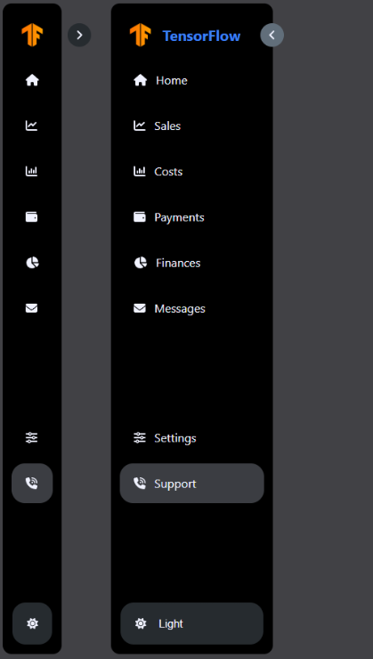

# 📁 Sidebar Test Task
## Краткое описание
Интерфейсный компонент **Sidebar**, разработанный в рамках тестового задания.  
Реализован с использованием **React** и **styled-components** с поддержкой **тёмной и светлой темы**,  
адаптивным поведением, анимацией открытия/закрытия и переключателем темы.

👉 Основная цель — сверстать и стилизовать Sidebar по макету, с фокусом на UI-детали и темизацию.

## Превью



##  Демо

Готовая версия доступна по ссылке:  
👉 [Посмотреть демо](https://n1ckdevops.github.io/sidebarTestTask/)

##  Технологии


## Установка и запуск

1. Клонируйте репозиторий:
   ```bash
   git clone https://github.com/n1ckdevops/sidebarTestTask.git
2. Перейдите в каталог проекта:
    ```
    cd sidebarTestTask

3. Установите зависимости:
    ```
    npm install

4. Запустите проект в режиме разработки:
    ```
    npm run dev

## Условия задания

### Что требовалось реализовать:
1. Создание компонента боковой панели (`Sidebar`) по дизайн-токенам используя `styled-components`
2. Изменение темы (светлая/темная) с помощью переключателя
3. Реализовать динамическое отображение текста при открытии/закрытии
4. Выложить готовую ссылку на демонстрацией


###  Что я сделал:
1. Создал компонент `Sidebar`, который поддерживает светлую/темную темы с возможностью переключения
2. Реализовал анимацию для плавного изменения ширины боковой панели при ее открытии и закрытии
3. Добавил к пунктам меню динамическое отображением текста, который скрывается при закрытой боковой панели
4. Внедрил кастомную кнопку для переключения темы (светлая/темная), которая изменяет стили компонента в зависимости от выбранной темы.

Таким образом, я создал функциональный компонент боковой панели с возможностью смены темы и анимациями.

## Особенности реализации

**Компонентность** — Вся логика и стили боковой панели (Sidebar) разделены: структура и поведение описаны в Sidebar.jsx, а стили — в Sidebar.styled.js с использованием styled-components.  
**Темизация** — Темная и светлая темы реализованы с помощью CSS-переменных (дизайн-токенов) и передаются через `ThemeProvider` из `styled-components`. Темы переключаются по клику.  
**Переключатель темы** — В нижней части сайдбара реализована кнопка смены темы.**Анимация** — Плавное открытие/закрытие боковой панели, скрытие/отображение текста пунктов меню и анимация кнопки сворачивания реализованы через CSS `transition`.  
**Состояния** — Активные и hover-состояния пунктов меню учитываются и стилизуются с помощью props в styled-components.

## Лицензия

Этот проект создан для выполнения тестового задания.

##  Автор

**Никита** — Frontend-разработчик  
📧 [nickdevops6@gmail.com](mailto:nickdevops6@gmail.com)  
🔗 [GitHub](https://github.com/n1ckdevops) | [Telegram](https://t.me/norman_grat)
